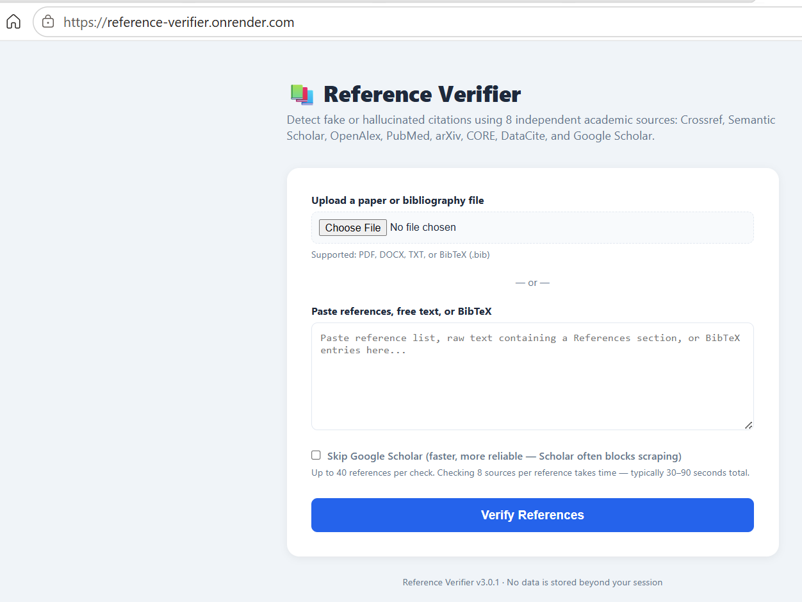
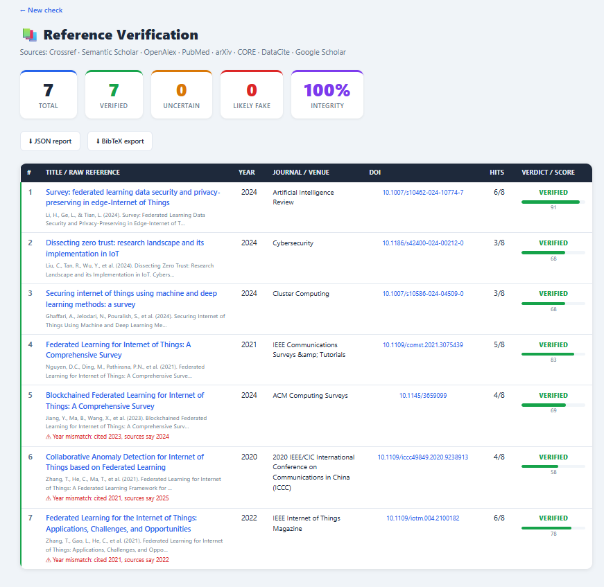

# 🚀 Free Academic Reference Verifier – Looking for Feedback!

As researchers, we've all encountered suspicious, incomplete, or even hallucinated citations generated by AI tools and literature review systems.

To help address this problem, I've developed a **Reference Verifier** that cross-checks references against multiple independent scholarly databases and identifies potentially fake, incorrect, or inconsistent citations.

### Check-My-Reference: https://reference-verifier.onrender.com/

### 🔍 What it does

* Verifies references against **8 academic sources**

  * Crossref
  * Semantic Scholar
  * OpenAlex
  * PubMed
  * arXiv
  * CORE
  * DataCite
  * Google Scholar

* Detects:
  * Hallucinated references
  * Incorrect metadata
  * DOI mismatches
  * Publication year inconsistencies
  * Missing or incomplete citation information

### 📊 Example Verification Results

Recently tested on 7 IoT/Federated Learning references:

<table>
<tr>
<td></td>
<td></td>
</tr>
</table>

✅ **7 Verified References**
⚠️ **3 Year Mismatches Detected**
❌ **0 Likely Fake References**

Examples of issues detected:

* *Blockchained Federated Learning for Internet of Things: A Comprehensive Survey*

  * Cited as **2023**
  * Verified sources indicate **2024**

* *Federated Learning for the Internet of Things: Applications, Challenges, and Opportunities*

  * Cited as **2021**
  * Verified sources indicate **2022**

### 📈 Current Features

* Reference integrity scoring
* DOI validation
* Multi-source verification
* JSON report export
* BibTeX export
* Verification confidence scores

### 🎯 Intended Users

* Researchers
* PhD Scholars
* Faculty Members
* Conference Organizers
* Journal Editors
* Students preparing theses/dissertations

### 💡 Why I Built This

With the growing use of AI-assisted writing, citation hallucinations have become a serious concern in academic publishing. My goal is to provide a simple tool that helps researchers validate references before manuscript submission.

### 🙏 Looking for Feedback

The tool is currently available for free testing.

I'd love feedback on:

* Accuracy of verification results
* User interface and workflow
* Additional features you'd like to see
* Integration with reference managers (Zotero, Mendeley, EndNote, etc.)

# check-my-reference
